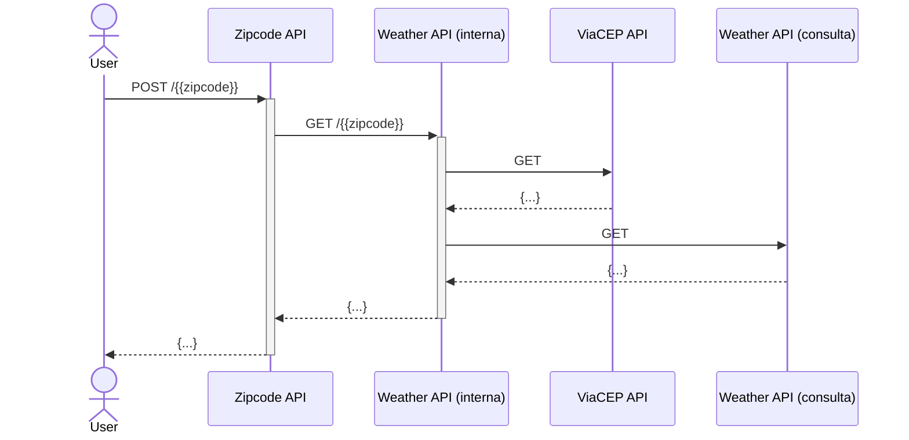

# Fluxo
Temos 2 aplicações. A primeira, chamei de Zipcode-API, e a segunda, Weather-API.

A Zipcode-API realiza a primeira validação do CEP que está sendo informado ([Ver diagrama de sequência](#sequence-diagram)).
Após a validação inicial, realiza outra requisição para a Weather-API, que por sua vez, busca o CEP na ViaCEP, e a partir do retorno, utilizamos a cidade para buscar a temperatura na WeatherAPI.

Conseguindo a temperatura em Celsius, nossa entidade é então criada, e o serviço de domínio se encarrega de calcular as conversões para as demais unidades de medida (Fahrenheit e Kelvin).

Uma vez tendo as 3 temperaturas, devolvemos na API o valor das mesmas.

## Sequence-Diagram



## Requests

```curl
curl -X POST localhost:8000/01234001
```

# Instrucoes

## Docker

Para executar o programa via docker, rode:
```sh
docker compose up --build -d
```

## Zipkin

Para visualizar o tracing, acesse http://localhost:9411
